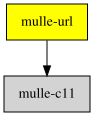

# mulle-url

#### 🈷️ Support for URL parsing

A C (C99) library to check if unicode characters are valid for the various
parts of an URL: scheme, host, user etc.
Used by **NSCharacterSet** extensions of MulleObjCInetFoundation.


| Release Version                                       | Release Notes  | AI Documentation
|-------------------------------------------------------|----------------|---------------
|  [](//github.com/mulle-c/mulle-url/actions) | [RELEASENOTES](RELEASENOTES.md) | [DeepWiki for mulle-url](https://deepwiki.com/mulle-c/mulle-url)


## Documentation & Guides

* [API Summary](asset/dox/api/toc)


### You are here




## Add

mulle-url is a component of the [mulle-core](//github.com/mulle-core/mulle-core) library. So in your code include the mulle-core umbrella header:

``` c
#include <mulle-core/mulle-core.h>
```

### Add mulle-core to a cmake and git project

``` bash
git submodule add https://github.com/mulle-core/mulle-core.git mulle-core
```

Add this to your `CMakeLists.txt`:

``` cmake
add_subdirectory( mulle-core)
target_link_libraries( ${PROJECT_NAME} PRIVATE mulle-core)
```


### Add mulle-core to a mulle-sde project

``` sh
mulle-sde add github:mulle-core/mulle-core
```

### Embed mulle-url with clib

``` sh
clib install --out src mulle-c/mulle-url
```

Append `src` to your include path (e.g. add `-isystem src`  to your `CFLAGS`)
and compile all the sources that were downloaded.


## Author

[Nat!](https://mulle-kybernetik.com/weblog) for Mulle kybernetiK  


